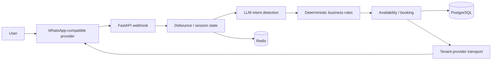

# Schedule Agent

Multi-tenant scheduling assistant for businesses that manage appointments through WhatsApp.

Schedule Agent is a public multi-tenant adaptation of a real WhatsApp scheduling system built for a barbershop client and used by real customers.

The private production code and client data are not included. This repository focuses on the reusable architecture, backend logic, and product direction.

## Highlights

- Based on a real production scheduling system.
- Built with Python, FastAPI, PostgreSQL, Redis, and Astro.
- Uses LLMs for intent detection while keeping booking logic deterministic.
- Designed as a multi-tenant SaaS architecture.
- Includes tests for scheduling, intake, provider configuration, and debounce behavior.

## Problem

Many appointment-based businesses still coordinate bookings manually over WhatsApp. That creates operational friction:

- slow replies during busy hours;
- duplicated or missed messages;
- booking mistakes when staff check availability by hand;
- lost reservations when a conversation is interrupted;
- hard-to-scale workflows when adding more staff, services, or locations.

Schedule Agent automates the conversation while keeping final booking decisions deterministic and auditable.

## What it does

- Schedules appointments conversationally from WhatsApp-style messages.
- Uses an LLM/OpenRouter integration to understand user intent.
- Manages services, barbers, days, working hours, absences, and extra hours.
- Maintains conversation state across turns.
- Debounces and coalesces burst messages to avoid duplicate replies.
- Separates provider and business configuration per tenant.
- Exposes a FastAPI JSON API and an Astro admin dashboard.

## Stack

| Area | Technology | Notes |
|------|------------|-------|
| Backend API | Python, FastAPI | JSON API and webhook intake. |
| Data | PostgreSQL, SQLAlchemy, Alembic | Main persistence and migrations. |
| Coordination | Redis | Optional sessions, locking, debounce, dedup, and queue coordination. |
| Admin UI | Astro, TypeScript | Dashboard under `apps/admin-astro/`. |
| Messaging | WhatsApp-compatible provider abstraction | Tenant-specific transport interface for messaging providers. |
| LLM | OpenRouter intent classifier | Deterministic fallback when no API key is configured. |
| Tests | pytest | Backend unit/integration coverage. |
| Deployment | Production experience with Railway | Public deployment config coming soon. |

## Architecture

The LLM is used to understand intent, not to decide whether a booking is valid. Availability, booking, cancellation, and rescheduling rules remain deterministic.



### Important technical decisions

- **LLM for intent only.** The model can classify what the user wants, but booking validity is decided by domain rules.
- **Deterministic scheduling rules.** Availability, double-booking prevention, past-time guards, barber constraints, and multi-slot services are handled in Python business logic.
- **Redis for operational safety.** Sessions, debounce, deduplication, locks, and queue coordination can use Redis when configured.
- **Tenant-separated configuration.** Provider credentials, settings, and operational configuration are stored per tenant.
- **Single-client lessons, SaaS-ready shape.** The original production problem came from a single client; this version is structured to evolve toward a multi-tenant SaaS product.

## Demo

A visual demo is coming soon.

For now, this example shows the intended booking flow:

Example conversation:

```text
Client: Hi, can I book a haircut tomorrow?
Agent: Sure. Which time works for you?
Client: Around 5 PM.
Agent: I have 5:00 PM available with Rodrigo. Should I confirm it?
Client: Yes, for Santiago.
Agent: Done. Your haircut is booked for tomorrow at 5:00 PM with Rodrigo.
```

> Do not add real client conversations or personal data to this repository.

## Project layout

```text
.
├── apps/
│   ├── api/src/                 # FastAPI app, routes, schemas, dependencies
│   └── admin-astro/             # Astro admin dashboard
├── packages/
│   ├── domain/                  # Pure scheduling/auth business rules
│   ├── application/             # Use cases, intake, messaging, services
│   └── infrastructure/          # Database models and repositories
├── tests/                       # Backend tests
├── solo-tenant-bot/             # Legacy reference only; do not import from here
├── alembic.ini                  # Migration config
├── pyproject.toml               # Backend package and tooling config
├── .env.example                 # Local environment template
└── FUTURE_IMPROVEMENTS.md       # Follow-up technical improvements
```

## Run locally

### 1. Clone the repository

```bash
git clone https://github.com/CodeSantiago/Schedule_agent.git
cd Schedule_agent
```

### 2. Configure environment

```bash
cp .env.example .env
```

Review `DATABASE_URL` and integration keys before running the app. Real provider credentials are optional for local development.

### 3. Start the backend

```bash
python -m venv .venv
source .venv/bin/activate
pip install -e ".[dev]"
alembic upgrade head
uvicorn apps.api.src.main:app --reload
```

PowerShell activation:

```powershell
.venv\Scripts\Activate.ps1
```

Useful backend URLs:

- `http://localhost:8000/health`
- `http://localhost:8000/docs`

### 4. Start the admin dashboard

```bash
cd apps/admin-astro
npm install
npm run dev
```

Dashboard URL:

- `http://localhost:4321/login`

### Docker

Docker is not configured in this public repo yet. For now, run the FastAPI app and Astro dashboard directly with the commands above.

## Environment variables

The canonical template is `.env.example`. Important variables:

| Variable | Purpose |
|----------|---------|
| `DATABASE_URL` | PostgreSQL connection string used by the backend and migrations. |
| `API_HOST`, `API_PORT`, `ENV` | API bind and environment settings. |
| `API_BASE_URL` | Base URL used by the admin dashboard to reach the API. |
| `ADMIN_HOST`, `ADMIN_PORT` | Admin dashboard host and port settings. |
| `KAPSO_API_KEY`, `KAPSO_BASE_URL` | WhatsApp/Kapso provider integration settings. |
| `KAPSO_WEBHOOK_SECRET` | Fallback webhook secret when a tenant-specific secret is not configured. |
| `OPENROUTER_API_KEY`, `OPENROUTER_BASE_URL`, `OPENROUTER_MODEL` | LLM intent detection configuration. |
| `REDIS_URL`, `REDIS_ENABLED` | Enables Redis-backed coordination when configured. |
| `BACKGROUND_QUEUE` | Selects threaded or in-process background work. |
| `DEDUP_WINDOW_SECONDS`, `LOCK_TTL_SECONDS` | Controls burst suppression and conversation lock timing. |

Never commit real credentials, production URLs, customer phone numbers, or client data.

## Tests and quality checks

Run backend tests from the repository root:

```bash
python -m pytest tests/ -v
```

The test suite covers scheduling and integration-sensitive behavior, including:

- availability and booking rules;
- cancellation and rescheduling behavior;
- conversation intake state;
- burst/debounce handling;
- intent parsing integrations;
- provider configuration and transport adapters.

Optional quality checks configured by the project:

```bash
ruff check .
mypy apps packages
```

Run dashboard checks from `apps/admin-astro/`:

```bash
npm run check
npm run build
```

## Current status

Implemented in this public codebase:

- FastAPI scheduling API;
- tenant, barber, service, schedule, absence, and extra-hours management;
- appointment booking, cancellation, rescheduling, and agenda endpoints;
- WhatsApp-style webhook intake;
- deterministic and OpenRouter-backed intent classification;
- WhatsApp-compatible provider transport abstraction;
- Redis-backed operational safety paths with graceful fallbacks;
- Astro admin dashboard for tenant and provider configuration.

Still evolving:

- production-ready provider onboarding flows;
- richer admin dashboard workflows;
- stronger observability and metrics;
- broader SaaS-level tenant operations;
- visual demo assets for the public README.

## Roadmap

- Expand the admin dashboard for day-to-day business operators.
- Add calendar integrations.
- Abstract additional messaging providers such as Telegram or other WhatsApp gateways.
- Add evaluation suites for intent detection quality.
- Support multi-branch / multi-location businesses.
- Improve metrics, logs, alerts, and operational observability.
- Add Docker/Railway deployment assets for reproducible public setup.

## Lessons learned

- LLMs work best here as language interpreters; deterministic code should own final business decisions.
- Idempotency and debounce are core product requirements, not infrastructure details.
- Conversational state must be explicit, inspectable, and recoverable.
- Production bots need clear logs, failure paths, and provider error handling.
- Turning a real single-client system into a multi-tenant product requires separating tenant configuration early.

## Privacy and client confidentiality

This repository does not include real client data, secrets, production credentials, private conversations, or confidential operational logic. The public codebase is a sanitized adaptation intended to show the architecture, product thinking, and technical tradeoffs behind the scheduling agent.


